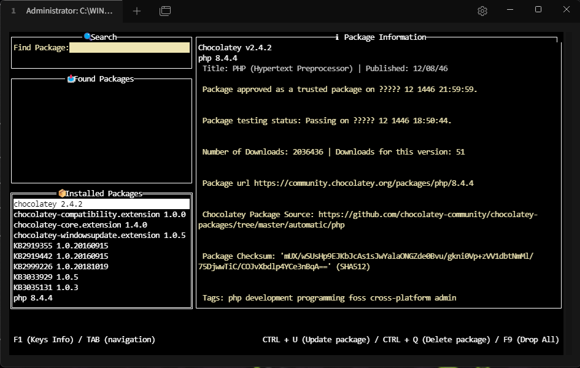
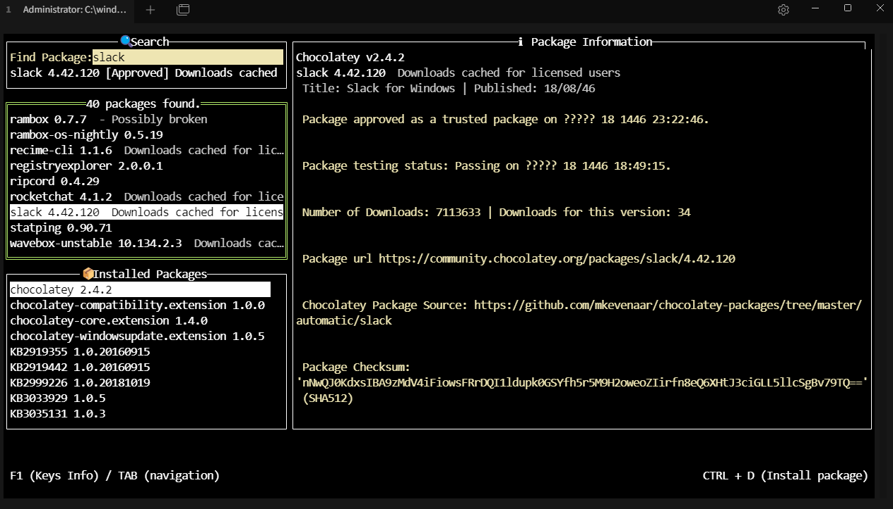

# Depoty


<p align="center">

</p>

## Description

Depoty is an extension of the **Chocolatey** package manager, offering users the ability to manage and interact with Chocolatey through an intuitive, text-based user interface (TUI). This lightweight application aims to simplify and enhance the user experience by providing a more accessible alternative to command-line operations, especially for those who prefer a TUI environment.

In addition to its core functionality, Depoty extends **Chocolatey** with additional features such as package search, installation, updates, and uninstallation—all in a streamlined, easy-to-navigate interface. it is an ideal choice for anyone looking to manage Chocolatey in a more visual and efficient manner."

## Showcasing

<p align="center">

</p>

<p align="center">

</p>

## Installation

Depoty can be installed using the following methods:

> [!WARNING]
> Since Chocolatey is designed for Windows, Depoty supports Windows only.

### Method 1: Manual Download

- Download the binary from the <a href="https://github.com/hish22/depoty/releases">Releases</a> page.

Next, initialize the environment variable for the path by adding the repository app path, or alternatively, execute the following PowerShell script.

```powershell
$currentPath = [Environment]::GetEnvironmentVariable("Path", "Machine")
$exeDir = "C:\path\to\depoty\"
$newPath = "$exeDir;" + $currentPath
[Environment]::SetEnvironmentVariable("Path", $newPath, "Machine")
```

> [!NOTE]
> Replace $exeDir with the path where depoty.exe is located.

### Method 2: Install via Chocolatey

Alternatively, If you have Chocolatey installed, you can install Depoty by running the following command:

```bash
choco install depoty
```

## Usage

Once installed, follow these steps to use Depoty:

1. Initialization: Run the following command to start the initialization process:

```bash
depoty init
```

2. Start the TUI: Once initialized, start the TUI (Text User Interface) by typing:

```bash
depoty
```

3. Main Viewport: You'll be presented with the main viewport where you can manage packages.

<p align="center">

</p>

## Key Functions

- Install a package by pressing `CTRL + D`
- Delete a package by pressing `CTRL + Q`
- Update a package by pressing `CTRL + U`
- Fetching package Information `Enter`
- Searching a specific package `CTRL + S`

Additional functions:

> [!NOTE]
> This command will only delete packages other than Chocolatey or its extensions.

- Drop/Delete all installed packages `F9`

> [!WARNING]
> Version 1.0.0 of Depoty will automatically uninstall Depoty if it was installed via Chocolatey.

- Navigation Button `TAB`
- Return to main veiwport `ESC`
- Refresh the installed packages `CTRL + R`

Other functions:

- Press `F1` for more details on key commands.

## Additional

If you want to clear the cache of the system, type:

```bash
depoty clear
```

To Display depoty commands, type:

```bash
depoty -h
```

which will clear the cache of the outdated packages and the configuration information.

> [!NOTE]
> If you decide to uninstall the app "sadly", make sure to clear the cache beforehand.

## Contributing

Feel free to fork and submit pull requests. Please refer to the contribution guidelines.
