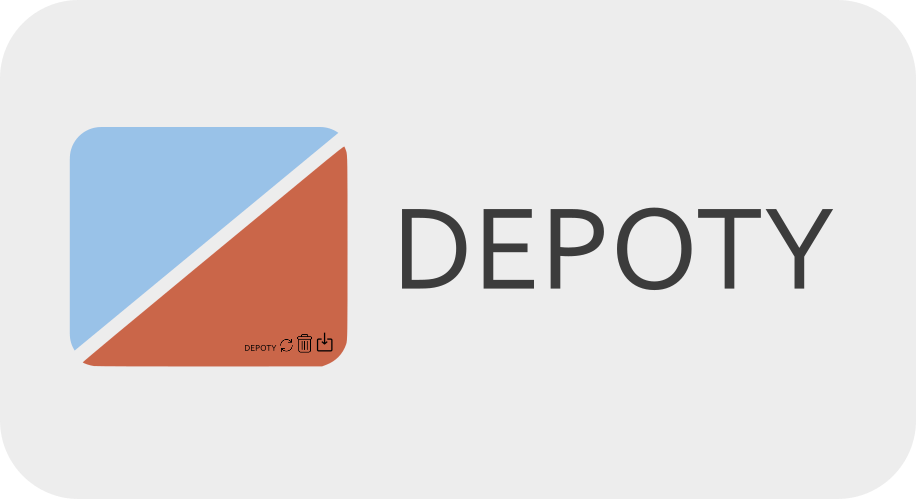

# 🚀 Depoty


<p align="center">

</p>

> [!NOTE]
> Depoty now supports Debian based linux.

## 📖 Description

Depoty is an extension of the Chocolatey and APT package managers, offering users a unified and intuitive Terminal User Interface (TUI) for managing software packages across both Windows and Linux systems. Designed with simplicity and usability in mind, Depoty transforms complex command-line operations into a user-friendly experience, ideal for users who prefer a more visual yet lightweight approach.

## 📸 Showcasing

<p align="center">

</p>

<p align="center">

</p>

<p align="center">

</p>

## 🔧 Installation

Depoty can be installed using the following methods:

### Windows:

- Download the binary from the <a href="https://github.com/hish22/depoty/releases">Releases</a> page.

Next, run the exe file to begin installing the program.

### Linux(Debian based):

- Fetch the binary from github:

```bash
wget https://github.com/hish22/depoty/releases/download/v1.1.0/depoty
```

- Make it executable

```bash
chmod +x depoty
```

- Move to a system path

```bash
sudo mv depoty /usr/local/bin/
```

## 📝 Usage

> [!IMPORTANT]
> Depoty should be used in a terminal with administrator privileges (Run as Administrator) to ensure proper functionality.

Once installed, follow these steps to use Depoty:

1. Initialization: Run the following command to start the initialization process:

```bash
depoty init
```

2. Start the TUI: Once initialized, start the TUI (Text User Interface) by typing:

on windows(as adminstrater):

```bash
depoty
```

on linux:

```bash
sudo depoty
```

3. Main Viewport: You'll be presented with the main viewport where you can manage packages.

## 📌 Key Functions

- Install a package by pressing `CTRL + D`
- Delete a package by pressing `CTRL + Q`
- Update a package by pressing `CTRL + U`
- Fetching package Information + Searching specific packages `Enter`
- Searching a specific package `CTRL + S`

Additional functions:

> [!NOTE]
> This command will only delete packages other than Chocolatey or its extensions.

> [!WARNING]
> Version 1.0.0 of Depoty will automatically uninstall Depoty if it was installed via Chocolatey and Drop all command used.

- Drop/Delete all installed packages `F9`

> [!NOTE]
> This command only works on windows (choco).

> [!NOTE]
> This command will update only the outdated packages.

on windows:

- Update all installed packages `F10`

on linux:

- Update all installed packages `F2`

- Navigation Button `TAB`
- Return to main viewport `ESC`
- Refresh the installed packages `CTRL + R`

Other functions:

- Press `F1` for more details on key commands.

## Additional

If you want to clear the cache of the system, type:

```bash
depoty clear
```

which will clear the cache of the outdated packages and the configuration information.

To Display depoty commands, type:

```bash
depoty -h
```

> [!NOTE]
> If you decide to uninstall the app "sadly", make sure to clear the cache beforehand.

<!-- ## Contributing

Feel free to fork and submit pull requests. Please refer to the contribution guidelines. -->

## 📢 Reporting Issues

If you encounter any problems, bugs, or have feature requests, feel free to open an issue!
